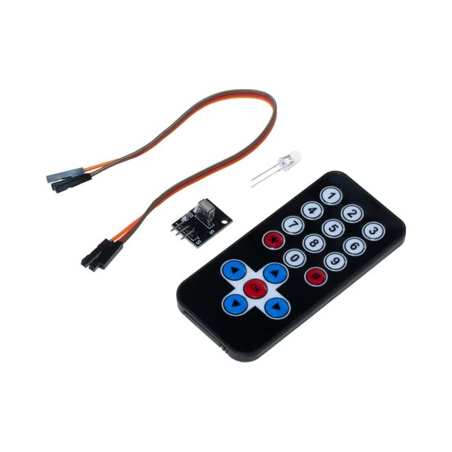

# STM32 IR ANALYZER
This project demonstrates how to receive and decode IR remote signals using an STM32 microcontroller. The firmware captures IR signals via an external interrupt, measures pulse widths with TIM2 timer, and decodes the 32-bit NEC protocol data. Decoded characters are output via UART (USART2) using printf.

<div style="text-align: center;">
  
</div>
This is IR Modules

<hr>

## Features
- Uses STM32 HAL library for hardware abstraction.
- Captures IR remote pulses with GPIO external interrupt on PA0 pin.
- Utilizes TIM2 timer as a time base to measure pulse durations.
- Decodes NEC IR protocol signals.
- Prints received characters via USART2 at 115200 baud rate.
- Includes basic error checking for IR data integrity.
<hr>

## Hardware Components

- STM32F407VG (or compatible STM32 MCU)
- IR Remote
- IR Receiver
- Jumper wires / Breadboard
<hr>

## Pin Connections

| Component        | STM32 Pins  |
|------------------|-------------|
| IR Receiver -    | GND         |
| IR Receiver +    | 3.3V        |
| IR Receiver Data | PA0 (EXTI0) |
| TTL to USB RX    | PA2 (TX)    |
| TTL to USB TX    | PA3 (RX)    |
<hr>

## Libraries Used

- `ir_remote.h` - The code that makes the control communication and performs protocol analysis.
- `retarget.h` - The code that integrates the printf function with USART2.
- `ir_protocol.h` - The code containing the corresponding characters of the keys on the control.

<hr>

## File Structure

```
/Core
    └── Src
        ├── ir_remote.c
        ├── retarget.c
    └── Inc
        ├── ir_remote.h
        ├── retarget.h
        ├── ir_protocol.h
```
>Note: Do not forget to change the peripherals you will use via the <strong>ir_remote.h</strong> file

<hr>

## Main Code 
```c
/* Private user code ---------------------------------------------------------*/
/* USER CODE BEGIN 0 */

#include "retarget.h"
#include <ir_remote.h>

uint32_t tempCode;
uint8_t bitIndex;
uint8_t cmd;
uint8_t cmdli;
uint32_t code;

void HAL_GPIO_EXTI_Callback(uint16_t GPIO_Pin)
{
  if(GPIO_Pin == IR_GPIO_PIN)
  {
    if (__HAL_TIM_GET_COUNTER(IR_TIMER) > 8000)
    {
      tempCode = 0;
      bitIndex = 0;
    }
    else if (__HAL_TIM_GET_COUNTER(IR_TIMER) > 1700)
    {
      tempCode |= (1UL << (31-bitIndex));   // write 1
      bitIndex++;
    }
    else if (__HAL_TIM_GET_COUNTER(IR_TIMER) > 1000)
    {
      tempCode &= ~(1UL << (31-bitIndex));  // write 0
      bitIndex++;
    }
    if(bitIndex == 32)
    {
      cmdli = ~tempCode; 	// Logical inverted last 8 bits
      cmd = tempCode >> 8; 	// Second last 8 bits
      if(cmdli == cmd) 		// Check for errors
      {
        code = tempCode; 	// If no bit errors

        //---------------Data writing by printf--------------//
        char data = IR_Get_Char(code);
        printf("%c\n", data);
        //---------------------------------------------------//
      }
      bitIndex = 0;
    }
    __HAL_TIM_SET_COUNTER(IR_TIMER, 0);
  }
}

/* USER CODE END 0 */

.
.
.
.

/* Initialize all configured peripherals */
  MX_GPIO_Init();
  MX_TIM2_Init();
  MX_USART2_UART_Init();
  /* USER CODE BEGIN 2 */

  IR_Init();
  printf("IR Remote Project is staring...\n\n");

  /* USER CODE END 2 */
```
<hr>

## License

This project is licensed under the MIT License. See the [LICENSE](LICENSE) file for details.
<hr>

## ✍️ Developer

**Semi Eren Gökyıldız**

